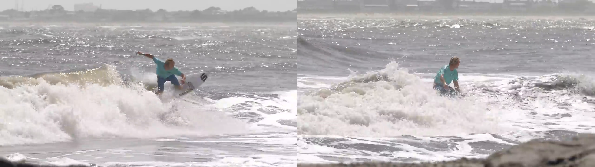

# UniReal Data Construction Toolkit

We provide the training data construction code for "UniReal: Universal Image Generation and Editing via Learning Real-world Dynamics"

This project includes:
1. Scripts for downloading images from Pexels using key words. 
2. Scripts for extracting frames from videos. 
3. Scripts for captioning the instructions for editing frame_1 to frame_2.
4. Scripts for constructing customized generation data~(segmenting, tracking,  and captioning the same object from two frames). 


## 1. Setup environment 
You need to install different packages for the requirement for different steps.

**Step1: download images from Pexels**

Direct launch

**Step2: extract frames from videos**

``pip install tqdm opencv-python numpy pillow decord scikit-image``

**Step3: caption instructions between frames**

If you use GPT API: ``pip install opencv-python pillow requests tqdm openai numpy`` 

If you use Qwen2.5-VL, please refer to https://github.com/QwenLM/Qwen2.5-VL to setup environment and download 7B checkpoint.

**Step4: segment, track, caption the same objects between frames**

Please refer to https://github.com/facebookresearch/sam2 to install requirements and download the ckpt of SAM 2.1 Large \


## 2. Launch Scripts

**Step1: download images from Pexels**

```
cd ./download_videos
set your API key and save root in __main__
python pexels_hd.py
```

**Step2: extract frames from videos**

```
cd ./extract_frames
We give an example in extract_vidgen.py, you should modify the paths in __main__
sh run_extract_vidgen.sh 
# we support runing multiple tasks in parallel, we divide the whole data into N parts and excute the k-th part.
```

You are expected to get concated two-frame images as following:


<br><br>

**Step3: caption instructions between frames**
```
cd ./instructive_caption
set you model_path, save_dir, data_dir inline 
sh run_caption_qw.sh 
# we support runing multiple tasks in parallel, we divide the whole data into N parts and excute the k-th part using the G-th GPU.
```
You are expected to get a json like following
```json
{
    "0_---_iRTHryQ_13_0to241.png": "Remove the text and logo from the bottom left corner.",
    "1000_-Rh0zUfqTIE_39_75to179.png": "Make the blue chair face away from the steering wheel.",
    "1001_-Rh0zUfqTIE_43_0to102.png": "Remove the person standing on the upper deck.",
    "1002_-Rh0zUfqTIE_7_41to169.png": "Move the boat slightly to the right.",
    ...
}
```

**Step4: segment, track, caption the same objects between frames**
```
cd ./subject_customization
cd ./notebooks 
We give examples for openvid and vidgen, if you take openvid:
set your paths, roots, and the indexes of the parts you want to prcess in process_data_openvid.py
bash process_data_vidgen.sh 
# we support runing multiple tasks in parallel, we divide the whole data into N parts and excute the k-th part using the G-th GPU.
```
You are expect to get segmentation resuls like `140002_HqhgIOhwjnk_5_58to321.png`


<br><br>

You would also get a json file with same name `140002_HqhgIOhwjnk_5_58to321.json`, where `[12,17]` means the starting and ending index for "a man" in the full caption. `[0.296875, 0.203125, 0.640625, 0.984375]` denotes the relative coordinates of corresponding box.

To match the mask with corresponding words, you could firt get the unique pixel values in the mask image. For example you get 0, 20, 40. Then you get the binary mask of 40, the index in the entity list would be 40 / 20 - 1 = 1, which corresponds to "a motorcycle".

```json
{
    "caption": "An image of a man standing in a room with a motorcycle and a desk in the background.",
    "entities": [
        [
            "a man",
            [
                12,
                17
            ],
            [
                [
                    0.296875,
                    0.203125,
                    0.640625,
                    0.984375
                ]
            ]
        ],
        [
            "a motorcycle",
            [
                42,
                54
            ],
            [
                [
                    0.046875,
                    0.546875,
                    0.328125,
                    0.984375
                ]
            ]
        ],
        [
            "a desk",
            [
                59,
                65
            ],
            [
                [
                    0.578125,
                    0.890625,
                    0.765625,
                    0.984375
                ]
            ]
        ]
    ]
}
```

