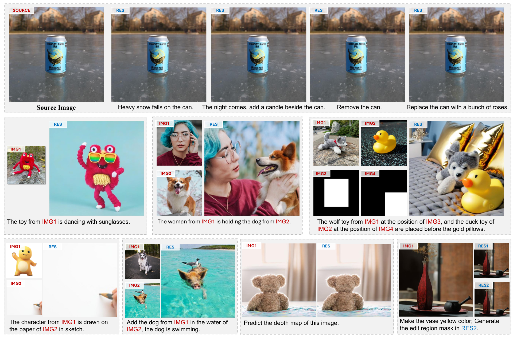

<p align="center">

  <h2 align="center">UniReal: Universal Image Generation and Editing via Learning Real-world Dynamics</h2>
  <p align="center">
    <a href="https://xavierchen34.github.io/"><strong>Xi Chen</strong><sup>1</sup></a>
    ·
    <a href="https://research.adobe.com/person/zhifei-zhang/"><strong>Zhifei Zhang</strong><sup>2</sup></a>
    ·
    <a href="https://research.adobe.com/person/he-zhang/"><strong>He Zhang</strong><sup>2</sup></a>
    ·
    <a href="https://research.adobe.com/person/yuqian-zhou/"><strong>Yuqian Zhou</strong><sup>2</sup></a>
    ·
    <a href="https://research.adobe.com/person/soo-ye-kim/"><strong>Soo Ye Kim</strong><sup>2</sup></a>
    ·
    <a href="https://research.adobe.com/person/qing-liu/"><strong>Qing Liu</strong><sup>2</sup></a>
    ·
    <a href="https://research.adobe.com/person/yijun-li/"><strong>Yijun Li</strong><sup>2</sup></a>
    ·
    <a href="https://research.adobe.com/person/jianming-zhang/"><strong>Jianming Zhang</strong><sup>2</sup></a>
    ·
    <br>
    <a href="https://research.adobe.com/person/nxzhao/"><strong>Nanxuan Zhao</strong><sup>2</sup></a>
    ·
    <a href="https://yilinwang.org/"><strong>Yilin Wang</strong><sup>2</sup></a>
    ·
    <a href="http://www.huiding.org/"><strong>Hui Ding</strong><sup>2</sup></a>
    ·
    <a href="https://research.adobe.com/person/zhe-lin/"><strong>Zhe Lin</strong><sup>2</sup></a>
    ·
    <a href="https://hszhao.github.io/"><strong>Hengshuang Zhao</strong><sup>1</sup></a>
    <br>
    <br>
        <a href="https://arxiv.org/pdf/2412.07774"></a>
        <a href='https://xavierchen34.github.io/UniReal-Page/'></a>
    <br>
    <b>The University of Hong Kong &nbsp; | &nbsp;  Adobe </b>
  </p>
  
  <table align="center">
    <tr>
    <td>
      
    </td>
    </tr>
  </table>


## News
* **[2025.6]** Release the data construction toolkit. See the detailed readme in `./data_construction`.
* **[todo]** We are working on a minimal reproduction for the model and training. Please stay tuned.


## Citation
If you find this codebase useful for your research, please use the following entry.
```BibTeX
@inproceedings{chen2025unireal,
  title={Unireal: Universal image generation and editing via learning real-world dynamics},
  author={Chen, Xi and Zhang, Zhifei and Zhang, He and Zhou, Yuqian and Kim, Soo Ye and Liu, Qing and Li, Yijun and Zhang, Jianming and Zhao, Nanxuan and Wang, Yilin and others},
  booktitle={Proceedings of the Computer Vision and Pattern Recognition Conference},
  pages={12501--12511},
  year={2025}
}
```